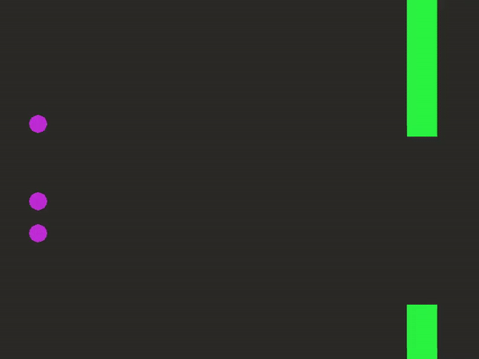
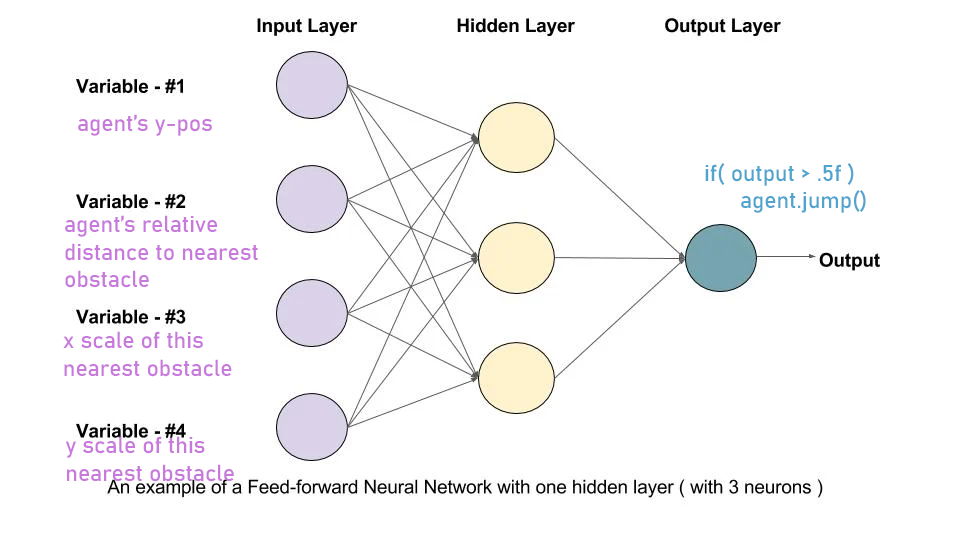

# flappyBirdNeuralNetworkFF
A Feed-Forward Neural Network which enables genetic progression of agents (birds) to beat Flappy Bird.

This is implemented entirely from **scratch** *without* TensorFlow or any other machine learning library.

Moreover, since my neural network is implemented entirely from scratch using just numpy and the basic principles of matrix operations, the agents are not given the best possible learning algoirthm or basis on which to succeed. However, I am, nonetheless, proud of my birdies!

**Training:**

**Generation 15:**

note: I made this in highschool (2017) and was not as good at implementing RL models back then. Let this serve as a nostalgic time piece and not a representation of my ML abilities.

also, unlike other RL repo's on my github, this project uses a genetic training algorithm based on Darwin's theory of evolution, not on a gradient descent policy with a DQN.
